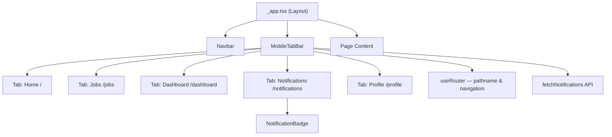

# Design Document: Mobile Tab Bar

## Overview

The mobile tab bar feature introduces a fixed bottom navigation component (`MobileTabBar`) for viewports narrower than 768px. It replaces the existing hamburger-menu pattern in `Navbar.tsx` on mobile with the ergonomic tab-bar convention common to native mobile apps.

The component is rendered at the layout level so it persists across all route transitions without unmounting. The existing `Navbar` remains unchanged for desktop and tablet users; only its hamburger menu toggle is hidden at the mobile breakpoint to prevent both patterns appearing simultaneously.

Design decisions:
- **Layout-level placement**: `MobileTabBar` is added to the Next.js layout (e.g., `_app.tsx`) rather than individual pages, ensuring it stays mounted during client-side navigation and avoids remount flicker.
- **Unread count from existing API**: The component reuses the `fetchNotifications` API already used by `NotificationBell`, polling on an interval and clearing the badge when the user navigates to `/notifications`.
- **No new context or state manager**: Local state inside `MobileTabBar` is sufficient; sharing notification state with the desktop `NotificationBell` is a secondary concern outside this feature's scope.
- **`next/link` for navigation**: Each tab renders a Next.js `<Link>` wrapping a visually styled element to ensure client-side navigation and native keyboard/accessibility behaviour.

---

## Architecture



`MobileTabBar` is a sibling of `Navbar` inside the shared layout. Both components read `useRouter().pathname` independently to determine active state.

---

## Components and Interfaces

### MobileTabBar (`frontend/components/MobileTabBar.tsx`)

```typescript
interface MobileTabBarProps {
  // No required props — reads auth context or publicKey for notification polling
  publicKey: string | null;
}
```

Internal tab configuration:

```typescript
interface TabConfig {
  href: string;         // Route path, e.g. "/"
  label: string;        // Display label, e.g. "Home"
  ariaLabel: string;    // aria-label value, e.g. "Home"
  icon: React.ReactNode;
}

const TABS: TabConfig[] = [
  { href: "/",              label: "Home",          ariaLabel: "Home",          icon: <HomeIcon /> },
  { href: "/jobs",          label: "Jobs",          ariaLabel: "Jobs",          icon: <BriefcaseIcon /> },
  { href: "/dashboard",     label: "Dashboard",     ariaLabel: "Dashboard",     icon: <DashboardIcon /> },
  { href: "/notifications", label: "Notifications", ariaLabel: "Notifications", icon: <BellIcon /> },
  { href: "/profile",       label: "Profile",       ariaLabel: "Profile",       icon: <UserIcon /> },
];
```

Key internal state:

```typescript
const [unreadCount, setUnreadCount] = useState<number>(0);
```

Notification polling mirrors `NotificationBell`: `fetchNotifications` is called on mount and every 30 seconds when `publicKey` is non-null. Navigating to `/notifications` clears `unreadCount` to `0`.

### Navbar modifications (`frontend/components/Navbar.tsx`)

The hamburger menu toggle `<button>` already has the class `md:hidden`. No change is required for the button itself — it is already invisible at `≥768px`. However, the button and the mobile dropdown menu panel must be audited to confirm they are hidden at mobile breakpoints while `MobileTabBar` is present. If the hamburger button needs to also be hidden below `md` (i.e., hidden always on mobile), its class should change from `md:hidden` to something equivalent to `hidden` on mobile, or conditionally rendered. Based on the current code, the hamburger toggle is `md:hidden`, meaning it shows on `< md` and hides on `≥ md`. To prevent it appearing alongside `MobileTabBar`, the toggle must be hidden at **all** breakpoints — effectively removed — or conditionally rendered based on a feature flag. The simplest approach: remove the `md:hidden` class and replace with `hidden` (never show) since `MobileTabBar` covers mobile navigation entirely.

---

## Data Models

### Tab State

No persistent data model is required. Active tab state is derived from `useRouter().pathname` on every render — it is not stored.

### Notification Badge State

```typescript
// Local component state
unreadCount: number  // 0 = no badge; >0 = show badge
```

Badge display logic:

```
displayText(n: number): string
  n <= 0  → badge not rendered
  1 ≤ n ≤ 99 → String(n)
  n > 99  → "99+"
```

This mirrors the existing logic in `NotificationBell.tsx`.

---

## Correctness Properties

*A property is a characteristic or behavior that should hold true across all valid executions of a system — essentially, a formal statement about what the system should do. Properties serve as the bridge between human-readable specifications and machine-verifiable correctness guarantees.*

### Property 1: Each tab renders icon, label, and aria-label

*For any* tab in the MobileTabBar's tab set, the rendered output should contain an icon element, a visible text label, and an `aria-label` attribute on the interactive element that matches the tab's destination name.

**Validates: Requirements 2.3, 6.2**

---

### Property 2: Exactly one tab is active for any matching pathname

*For any* pathname that exactly matches one of the five tab routes, that tab and only that tab should have the active visual class applied and `aria-current="page"` set; all other tabs should have neither.

**Validates: Requirements 3.1, 3.3, 6.3**

---

### Property 3: Badge displays numeric count for counts 1–99

*For any* unread notification count `n` where `1 ≤ n ≤ 99`, the notification badge should be present in the rendered output and its text content should equal `String(n)`. For `n = 0`, the badge should not be rendered.

**Validates: Requirements 4.1, 4.2, 4.3**

---

### Property 4: Badge displays "99+" for counts above 99

*For any* unread notification count `n` where `n > 99`, the notification badge should display the string `"99+"` rather than the numeric value.

**Validates: Requirements 4.4**

---

### Property 5: Badge cleared on navigation to /notifications

*For any* state where `unreadCount > 0`, when the router pathname changes to `/notifications`, the badge should no longer be rendered.

**Validates: Requirements 4.5**

---

### Property 6: Badge sr-only text present when count is positive

*For any* unread count `n > 0`, the rendered badge should include an element with the `sr-only` class whose text content conveys the notification count to screen readers.

**Validates: Requirements 6.4**

---

## Error Handling

| Scenario | Behaviour |
|---|---|
| `fetchNotifications` API call fails | Catch error silently; `unreadCount` stays at its previous value (or `0` on first load). No error UI is shown — the badge is a non-critical enhancement. |
| `publicKey` is null (unauthenticated user) | Skip notification polling entirely; badge is never rendered. |
| Router pathname does not match any tab route | No tab receives the active style. This is valid (e.g., a sub-page like `/jobs/123`). |
| Navigation to an unknown route from a tab | Next.js handles 404 natively; `MobileTabBar` remains mounted and updates active state to the new pathname. |

---

## Testing Strategy

### Dual Testing Approach

Both unit tests and property-based tests are required. Unit tests handle specific structural and integration examples; property-based tests verify universal correctness across generated inputs.

### Unit Tests

Located at `frontend/components/__tests__/MobileTabBar.test.tsx` (using Jest + React Testing Library, matching the project's existing test setup).

Target examples and edge cases:

- Renders a `<nav>` with `aria-label="Mobile navigation"` (Req 6.1)
- Root element has `md:hidden` class (Req 1.2)
- Renders exactly 5 tab items (Req 2.1)
- Tabs appear in the correct order: Home, Jobs, Dashboard, Notifications, Profile (Req 2.1)
- Each tab uses a `<Link>` (next/link) — no bare `<a href>` that would cause a full reload (Req 5.2)
- All tab interactive elements are `<a>` or `<button>` elements (keyboard navigability, Req 6.5)
- Badge is absent when `unreadCount = 0` (edge case for Req 4.2)
- Hamburger toggle is absent / hidden in Navbar when MobileTabBar is active (Req 1.3)

### Property-Based Tests

Located at `frontend/components/__tests__/MobileTabBar.property.test.tsx`.

Using **fast-check** (already available in the JavaScript/TypeScript ecosystem and consistent with the project's tech stack).

Each property test runs a minimum of **100 iterations**.

#### Property Test 1: Each tab renders icon, label, and aria-label

```
// Feature: mobile-tab-bar, Property 1: each tab renders icon, label, and aria-label
fc.assert(
  fc.property(fc.constantFrom(...TABS), (tab) => {
    const { getByRole } = render(<MobileTabBar publicKey={null} />, { router: { pathname: "/other" } });
    const link = getByRole("link", { name: tab.ariaLabel });
    expect(link).toBeInTheDocument();
    expect(link.querySelector("svg")).toBeInTheDocument(); // icon
    expect(link).toHaveTextContent(tab.label);             // label
  }),
  { numRuns: 100 }
);
```

**Validates: Requirements 2.3, 6.2**

---

#### Property Test 2: Exactly one active tab per matching pathname

```
// Feature: mobile-tab-bar, Property 2: exactly one active tab for any matching pathname
fc.assert(
  fc.property(fc.constantFrom("/", "/jobs", "/dashboard", "/notifications", "/profile"), (pathname) => {
    const { getAllByRole } = render(<MobileTabBar publicKey={null} />, { router: { pathname } });
    const links = getAllByRole("link");
    const activeLinks = links.filter(l => l.getAttribute("aria-current") === "page");
    expect(activeLinks).toHaveLength(1);
    expect(activeLinks[0]).toHaveAttribute("href", pathname);
  }),
  { numRuns: 100 }
);
```

**Validates: Requirements 3.1, 3.3, 6.3**

---

#### Property Test 3: Badge shows numeric count for 1–99

```
// Feature: mobile-tab-bar, Property 3: badge shows numeric count for 1-99
fc.assert(
  fc.property(fc.integer({ min: 1, max: 99 }), (count) => {
    const { getByText } = render(<MobileTabBar publicKey="GPUBKEY" initialUnreadCount={count} />);
    expect(getByText(String(count))).toBeInTheDocument();
  }),
  { numRuns: 100 }
);
```

**Validates: Requirements 4.1, 4.2, 4.3**

---

#### Property Test 4: Badge shows "99+" for counts above 99

```
// Feature: mobile-tab-bar, Property 4: badge displays "99+" for counts above 99
fc.assert(
  fc.property(fc.integer({ min: 100, max: 10000 }), (count) => {
    const { getByText } = render(<MobileTabBar publicKey="GPUBKEY" initialUnreadCount={count} />);
    expect(getByText("99+")).toBeInTheDocument();
  }),
  { numRuns: 100 }
);
```

**Validates: Requirements 4.4**

---

#### Property Test 5: Badge cleared on navigation to /notifications

```
// Feature: mobile-tab-bar, Property 5: badge cleared on navigation to /notifications
fc.assert(
  fc.property(fc.integer({ min: 1, max: 999 }), (count) => {
    const { queryByRole, rerender } = render(
      <MobileTabBar publicKey="GPUBKEY" initialUnreadCount={count} />,
      { router: { pathname: "/jobs" } }
    );
    // Badge present before navigation
    expect(queryByRole("status")).toBeInTheDocument();
    // Navigate to /notifications
    rerender(<MobileTabBar publicKey="GPUBKEY" initialUnreadCount={count} />, { router: { pathname: "/notifications" } });
    expect(queryByRole("status")).not.toBeInTheDocument();
  }),
  { numRuns: 100 }
);
```

**Validates: Requirements 4.5**

---

#### Property Test 6: sr-only badge text present for positive counts

```
// Feature: mobile-tab-bar, Property 6: sr-only text present when badge count is positive
fc.assert(
  fc.property(fc.integer({ min: 1, max: 10000 }), (count) => {
    const { container } = render(<MobileTabBar publicKey="GPUBKEY" initialUnreadCount={count} />);
    const srOnly = container.querySelector(".sr-only");
    expect(srOnly).toBeInTheDocument();
    expect(srOnly?.textContent).toMatch(/\d|99\+/);
  }),
  { numRuns: 100 }
);
```

**Validates: Requirements 6.4**

---

### Test Configuration

- Property-based testing library: **fast-check** (`npm install --save-dev fast-check`)
- Minimum iterations per property test: **100** (`numRuns: 100`)
- Test runner: **Jest** (existing project setup)
- Component rendering: **React Testing Library** (existing project setup)
- Router mocking: wrap renders with a mock `RouterContext` provider that accepts a `pathname` prop
