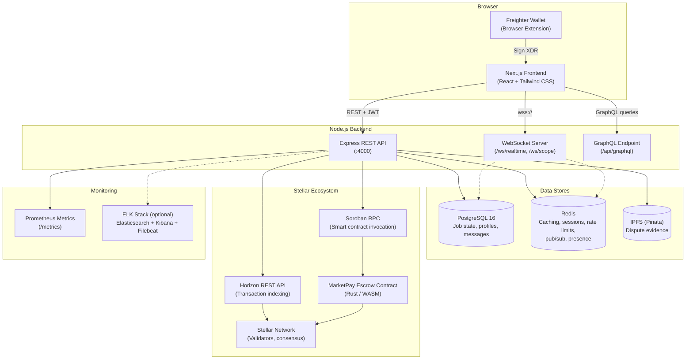
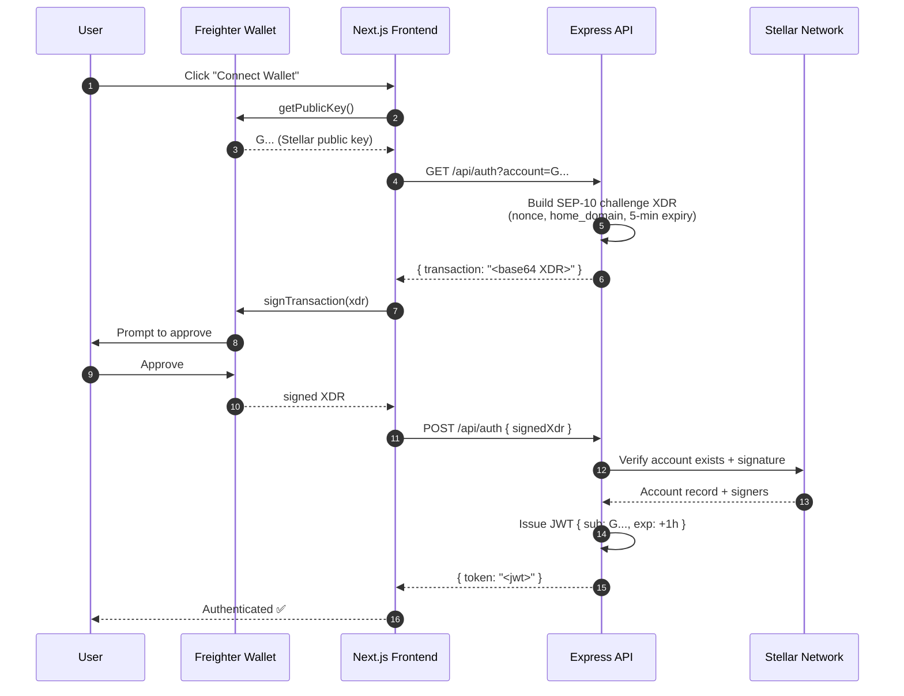
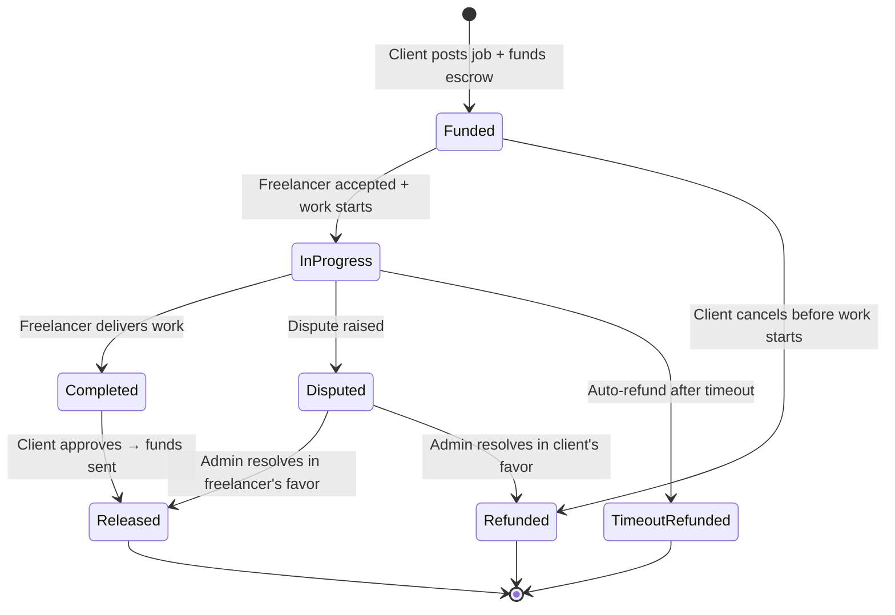
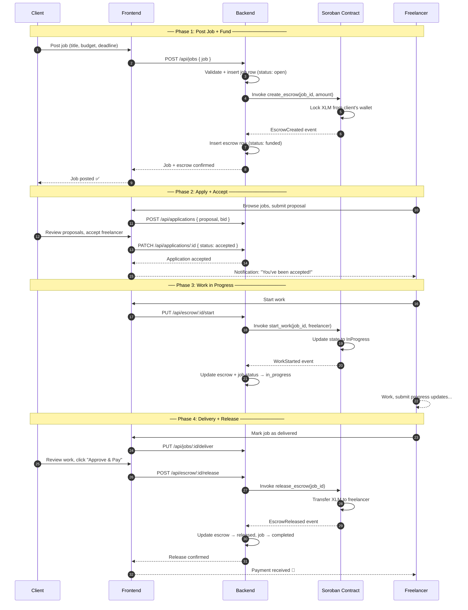
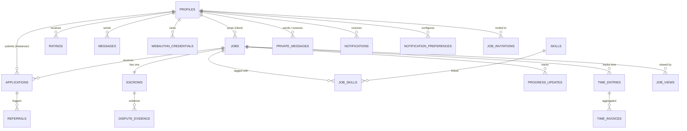

# Architecture — Stellar MarketPay

A high-level architecture guide for new contributors. This document describes the system design, core flows, and runtime services that power Stellar MarketPay.

---

## Table of Contents

1. [System Diagram](#system-diagram)
2. [Technology Stack](#technology-stack)
3. [Authentication Flow (SEP-10)](#authentication-flow-sep-10)
4. [Escrow Lifecycle](#escrow-lifecycle)
5. [API Design](#api-design)
6. [Data Model](#data-model)
7. [Real-Time Communication](#real-time-communication)
8. [Background Services](#background-services)
9. [Deployment Architecture](#deployment-architecture)
10. [Security Model](#security-model)
11. [Related Documents](#related-documents)

---

## System Diagram



### Data-Flow Summary

| Step | Description |
|------|-------------|
| ①  | **Browser** renders the Next.js SPA. Freighter wallet signs Stellar transactions locally; private keys never leave the browser. |
| ②  | **Express API** is the primary backend. Authenticated via SEP-10 JWT. Handles jobs, profiles, applications, escrow, messaging, disputes, notifications, admin. |
| ③  | **PostgreSQL** stores all persistent state: profiles (keyed by Stellar public key), jobs, applications, escrows, ratings, messages, notifications, time entries, referrals, disputes. |
| ④  | **Redis** caches Horizon API responses, stores SEP-10/WebAuthn challenges, enforces rate limits, tracks WebSocket presence, and coordinates pub/sub across multiple server instances. |
| ⑤  | **Horizon API** indexes Stellar ledger transactions. The backend queries it for transaction history and account state. |
| ⑥  | **Soroban smart contract** (Rust/WASM) is the trustless escrow: `create_escrow` → `start_work` → `release_escrow` / `refund_escrow`. The backend invokes it via Soroban RPC. |
| ⑦  | **WebSocket** provides real-time push: job applications, messages, escrow status changes, presence, and the collaborative scope editor (`/ws/scope/:id`). |
| ⑧  | **Prometheus** exposes metrics at `/metrics`; optional ELK stack for centralized logging. |

---

## Technology Stack

| Layer | Technology | Purpose |
|-------|-----------|---------|
| **Frontend** | Next.js 14, React 18, TypeScript, Tailwind CSS | SPA with SSR, component library, Storybook |
| **Backend** | Node.js, Express 4, `ws` | REST API, WebSocket server, GraphQL |
| **Database** | PostgreSQL 16, `pg_trgm`, `pgcrypto` | Persistent state, full-text search, encryption |
| **Cache / Sessions** | Redis 7, ioredis | Ephemeral state, rate limits, pub/sub |
| **Blockchain** | Stellar Testnet, Soroban | Decentralized escrow and payments |
| **Smart Contracts** | Rust, `soroban-sdk`, WASM | Trustless escrow, arbitrator registry |
| **Wallet** | Freighter Browser Extension | SEP-10 auth, transaction signing |
| **File Storage** | IPFS (Pinata) | Decentralized dispute evidence storage |
| **Monitoring** | Prometheus, optional ELK | Metrics, logging, alerting |
| **CI/CD** | GitHub Actions, Docker, GHCR | Build, test, deploy |
| **E2E Testing** | Playwright | Full marketplace flow tests |
| **Load Testing** | k6 | Performance benchmarks |

---

## Authentication Flow (SEP-10)

Stellar MarketPay uses **SEP-10** — a password-less challenge-response protocol where users prove ownership of their Stellar account by signing a server-generated transaction with their wallet.

### Happy Path



### Key Properties

- **Password-less**: Users never create or share a secret with the app.
- **Stateless**: The server stores no session state; all claims are in the JWT.
- **Short-lived tokens**: JWT expires after 1 hour; clients silently re-run SEP-10 to refresh.
- **2FA Extensions**: Optional TOTP (time-based one-time password) and WebAuthn (passkey) as second factors. If enabled, SEP-10 returns `{ mfa_required: true, mfa_token }` and the client completes 2FA before receiving the full JWT.
- **Token storage**: `httpOnly` cookie recommended in production; `localStorage` acceptable for development.

### Relevant Files

| File | Purpose |
|------|---------|
| `backend/src/routes/auth.js` | Challenge/response endpoints |
| `backend/src/middleware/auth.js` | JWT verification middleware |
| `backend/src/services/authTokens.js` | JWT generation and management |
| `backend/src/routes/twoFactor.js` | TOTP 2FA endpoints |
| `backend/src/routes/webauthn.js` | WebAuthn/passkey endpoints |
| `backend/src/services/webauthnService.js` | WebAuthn credential management |
| `docs/auth-flow.md` | Full SEP-10 flow with error scenarios |
| `docs/ADR-004-sep10-authentication.md` | Why SEP-10 was chosen |

---

## Escrow Lifecycle

The escrow lifecycle is the core of Stellar MarketPay. Client funds are locked in a Soroban smart contract and released only when work is approved — no middleman, no payment delays.

### State Machine



### End-to-End Flow



### Milestone-Based Escrow

For larger jobs, clients can define **milestones** with percentage-based payouts:

- `create_escrow` accepts an array of milestone percentages (must sum to 100%).
- Each milestone is released independently via `release_escrow` with a `milestone_index`.
- The freelancer can request milestone approval; the client approves or disputes.

### Recurring / Retainer Escrow

For ongoing contracts, the **recurring escrow service** (`backend/src/services/recurringEscrowService.js`) automates periodic payments:
- Creates a new escrow at each interval (e.g., weekly, monthly).
- Automatically releases funds per the agreed schedule.
- Ticked every hour by `startRecurringEscrowTicker()`.

### Timeout & Dispute Handling

- **Timeout refund**: If the freelancer doesn't start work within the configured ledger timeout, the client can call `refund_escrow`. A background checker runs hourly.
- **Disputes**: Either party can raise a dispute. Evidence is uploaded to IPFS (Pinata). An admin reviews and resolves. The `escrow_disputes` table tracks the full resolution lifecycle.

### Oracle-Based Deliverable Verification

The contract supports a **deliverable hash oracle**: the freelancer submits a hash of their deliverable; the client verifies it. Matching hashes auto-release the escrow. Mismatches auto-enter dispute.

### Relevant Files

| File | Purpose |
|------|---------|
| `contracts/marketpay-contract/src/lib.rs` | Soroban escrow contract — state machine, milestone logic, events |
| `backend/src/routes/escrow.js` | Escrow API endpoints |
| `backend/src/services/escrowService.js` | Escrow timeout checker, release/refund logic |
| `backend/src/services/recurringEscrowService.js` | Recurring escrow ticker |
| `backend/src/services/escrowGuardianService.js` | Multi-sig guardian for high-value jobs |
| `backend/src/services/indexerService.js` | Indexes contract events into PostgreSQL |
| `backend/src/services/sorobanClient.js` | Soroban RPC client |
| `backend/src/services/ipfsService.js` | IPFS upload/retrieval for dispute evidence |
| `docs/ADR-001-soroban-escrow-design.md` | Why Soroban was chosen |
| `docs/ADR-003-database-schema-escrow.md` | Escrow database schema design |
| `docs/contract-deployment.md` | How to build and deploy the escrow contract |

---

## API Design

### REST API

The backend exposes a RESTful API under `/api/*`. All authenticated endpoints require `Authorization: Bearer <jwt>`.

| Group | Prefix | Key Endpoints |
|-------|--------|---------------|
| **Auth** | `/api/auth` | `GET ?account=` (challenge), `POST` (verify) |
| **Jobs** | `/api/jobs` | CRUD for job postings, search, filters |
| **Applications** | `/api/applications` | Submit proposals, accept/reject |
| **Profiles** | `/api/profiles`, `/api/freelancers` | Profile CRUD, search |
| **Escrow** | `/api/escrow` | Fund, start, release, refund, status |
| **Messages** | `/api/messages` | Job-scoped chat, E2E encrypted DMs |
| **Ratings** | `/api/ratings` | Post-job reviews |
| **Notifications** | `/api/notifications` | In-app notification inbox |
| **Disputes** | `/api/disputes` | Raise, evidence upload, resolve |
| **Admin** | `/api/admin` | Dashboard, user management, analytics |
| **Developer** | `/api/developer` | API key management, usage metrics |
| **Referrals** | `/api/referrals` | Referral tracking and payouts |
| **Time Entries** | `/api/time-entries` | Hourly time tracking |
| **Invitations** | `/api/invitations` | Client → freelancer direct invites |
| **DAO** | `/api/dao` | Governance proposals and voting |
| **Stats** | `/api/stats` | Platform metrics |
| **Insights** | `/api/insights` | Freelancer earnings insights |
| **GraphQL** | `/api/graphql` | Alternative query interface |
| **Health** | `/health` | Service health check |

**Common patterns:**
- **Cursor-based pagination** on list endpoints (see ADR-010).
- **Idempotency keys** for `POST` endpoints — pass `Idempotency-Key` header to prevent duplicate mutations.
- **Rate limiting**: 150 requests / 15 min per IP by default, scaled per environment.
- **Swagger docs**: Available at `/api/docs` with OpenAPI spec at `docs/openapi.json`.

### API Client SDKs

Generated client libraries are documented in `docs/api-client-sdk.md` (TypeScript, Python, Go).

### Relevant Files

| File | Purpose |
|------|---------|
| `backend/src/server.js` | Express app setup, route registration, middleware pipeline |
| `backend/src/config/swagger.js` | OpenAPI spec |
| `docs/API_DOCUMENTATION.md` | Full API reference |
| `docs/api.md` | Detailed API docs |
| `docs/ADR-010-cursor-pagination.md` | Pagination strategy |

---

## Data Model

The database schema lives at `backend/src/db/schema.sql` and is applied idempotently on every server start via `backend/src/db/migrate.js`. **20+ migration versions** live in `backend/src/db/migrations/`.

### Core Entity Relationships



### Key Tables

| Table | Primary Key | Description |
|-------|------------|-------------|
| `profiles` | `public_key` (Stellar G... address) | Central identity — no separate users table |
| `jobs` | `id` UUID | Job listings with full-text search (`tsvector`) |
| `applications` | `id` UUID | Freelancer proposals; `UNIQUE(job_id, freelancer_address)` |
| `escrows` | `id` UUID | Off-chain mirror of on-chain escrow state |
| `messages` | `id` UUID | Job-scoped chat messages |
| `private_messages` | `id` UUID | NaCl-box encrypted DMs (server never sees plaintext) |
| `ratings` | `id` UUID | 1–5 star reviews; `UNIQUE(job_id, rater_address)` |
| `time_entries` | `id` UUID | Hourly work logs |
| `time_invoices` | `id` UUID | Aggregated invoices from time entries |
| `referrals` | `id` UUID | Referrer-referee tracking; `UNIQUE(referrer, referee)` |
| `notifications` | `id` UUID | In-app notification inbox |
| `notification_preferences` | `id` UUID | Per-user, per-type, per-channel opt-in/out |
| `webauthn_credentials` | `id` UUID | FIDO2/WebAuthn passkey credentials |
| `dispute_evidence` | `id` UUID | IPFS-pinned evidence files |
| `job_invitations` | `id` UUID | Direct client → freelancer invites |
| `scope_sessions` | `session_id` TEXT PK | Collaborative scope editor documents |
| `skills` / `job_skills` | — | Normalized skill taxonomy + job tags |
| `platform_metrics` | `id` UUID | Time-bucketed analytics (hourly/daily/weekly) |
| `notification_queue` | (internal) | Pending notification dispatch queue (processed every 2 min) |
| `idempotency_keys` | `key` TEXT PK | POST response caching for idempotent mutations |
| `ledger_timestamps` | `ledger` INTEGER PK | Stellar ledger → wall-clock time mapping |

### Full-Text Search

Jobs are indexed via PostgreSQL `tsvector` and trigram (`pg_trgm`) indexes for fast fuzzy search:

- `jobs.job_search_vector` — `GENERATED ALWAYS AS (setweight(to_tsvector('english', title), 'A') || setweight(to_tsvector('english', description), 'B'))`
- `jobs_search_vector_idx` — GIN index
- `jobs_title_trgm_idx`, `jobs_description_trgm_idx` — GIN trigram indexes

### Relevant Files

| File | Purpose |
|------|---------|
| `backend/src/db/schema.sql` | Canonical schema (idempotent) |
| `backend/src/db/migrate.js` | Migration runner |
| `backend/src/db/migrations/` | 20+ versioned migration files |
| `backend/src/db/pool.js` | PostgreSQL connection pool |
| `docs/database-schema.md` | Full schema documentation with ERD |

---

## Real-Time Communication

### WebSocket Architecture

Real-time features use **WebSocket** (via the `ws` library) upgraded from the same HTTP server:

```
Client → wss://host/ws/realtime → realtimeClients Set → broadcastRealtime()
Client → wss://host/ws/scope/:id → scopeSessionClients Map → collaborative editing
```

### Message Flow

1. **Backend emits events** via `broadcastRealtime(event, payload)` → all connected realtime clients.
2. **Per-user delivery** via `broadcastToUser(userAddress, event, payload)` — uses Redis pub/sub for multi-server coordination.
3. **Scope sessions** support collaborative document editing with cursor awareness, debounced at ~2 seconds per update. Sessions expire after 24 hours.

### Real-Time Event Types

| Event | Trigger | Channel |
|-------|---------|---------|
| `notification` | New application, message, escrow change | `broadcastToUser()` |
| `escrow-update` | Escrow funded, started, released, refunded | `broadcastRealtime()` |
| `jobs:expired` | Job expiry checker finds expired jobs | `broadcastRealtime()` |
| `job:expiry-warning` | Job expires within 3 days | `broadcastRealtime()` |
| `scope:init` | Client connects to scope session | `/ws/scope/:id` |
| `scope:update` | Participant edits scope document | `/ws/scope/:id` |
| `scope:finalized` | Scope document is locked | `/ws/scope/:id` |

### Fallback Polling

Some frontend hooks (e.g., `useRealtimeBids.ts`) fall back to HTTP polling when the WebSocket connection is unavailable, ensuring functionality even behind restrictive firewalls.

### Relevant Files

| File | Purpose |
|------|---------|
| `backend/src/server.js` | WebSocket server setup, scope session logic |
| `backend/src/services/notificationService.js` | Notification dispatch, broadcast wiring |
| `frontend/hooks/useRealtimeBids.ts` | Realtime bid updates with fallback polling |
| `docs/websocket-scope-protocol.md` | Scope session protocol specification |
| `docs/ADR-009-websocket-vs-sse.md` | Why WebSocket was chosen over SSE |

---

## Background Services

All background services are started during `bootstrap()` in `backend/src/server.js`. Here is the complete list:

### Continuously Running Services

| Service | File | Interval | Description |
|---------|------|----------|-------------|
| **Indexer Service** | `services/indexerService.js` | Continuous (streaming) | Indexes Stellar transactions and Soroban contract events into PostgreSQL. Uses Horizon SSE streaming. |
| **Price Alert Service** | `services/priceAlertService.js` | Continuous (`setInterval`) | Monitors XLM price and sends alerts when thresholds are crossed. |
| **Pool Health Check** | `server.js` (inline) | Every 1 second | Monitors PostgreSQL connection pool; fires webhook alert if requests queue for >10s. |

### Scheduled Tasks (setInterval-based)

| Task | Interval | Description |
|------|----------|-------------|
| **Job Expiry Checker** | Every 1 hour | Auto-expires old job listings; sends 3-day expiry warnings. |
| **Escrow Timeout Checker** | Every 1 hour | Checks for timed-out escrows and auto-processes refunds. |
| **Notification Processor** | Every 2 minutes | Processes the `notification_queue` table — dispatches emails and in-app notifications. |
| **Idempotency Key Cleanup** | Every 1 hour | Removes expired idempotency key cache entries. |
| **WS Event Cleanup** | Every 1 hour | Purges WebSocket events older than 7 days. |
| **Scope Session Cleanup** | Every 1 hour | Deletes expired collaborative scope sessions. |
| **Purge Deleted Records** | Every 24 hours | Hard-deletes soft-deleted jobs and profiles older than 90 days. |
| **Recurring Escrow Ticker** | Every 1 hour | Ticks recurring escrows — releases payments on schedule. |
| **Saved Search Alert Checker** | Every 10 minutes | Checks for new jobs matching saved search criteria; sends email alerts. |
| **API Key Rotation Finalizer** | Every 1 hour | Promotes `rotating_key_hash` → active `key_hash` after 24h grace period. |

### Weekly Cron-Style Schedulers

| Task | Schedule | Description |
|------|----------|-------------|
| **Weekly Digest Scheduler** | Every Monday 09:00 UTC | Sends weekly job digest emails to active freelancers. Uses a one-shot `setTimeout` + 7-day `setInterval` pattern to avoid drift. |
| **Admin Report Scheduler** | Every Monday 08:00 UTC | Generates and emails weekly admin PDF reports (1 hour before freelancer digest). |

### Queue-Based Workers

| Worker | Queue | Description |
|--------|-------|-------------|
| **Email Worker** | `utils/queue.js` (job queue) | Processes async email jobs (verification, notifications, digests). |
| **WS Event Queue** | `utils/wsEventQueue.js` | Buffers WebSocket events for reliable delivery. |

### Relevant Files

| File | Purpose |
|------|---------|
| `backend/src/server.js` | `bootstrap()` — starts all background services |
| `backend/src/services/indexerService.js` | Stellar event indexing |
| `backend/src/services/weeklyDigestService.js` | Weekly freelancer digest |
| `backend/src/services/jobDigestService.js` | Daily job digest (cron-targeted) |
| `backend/src/services/savedSearchAlertService.js` | Saved search alerts |
| `backend/src/services/wsEventCleanupService.js` | WS event cleanup |
| `backend/src/services/escrowService.js` | Escrow timeout checker |
| `backend/src/services/recurringEscrowService.js` | Recurring escrow ticker |
| `backend/src/services/priceAlertService.js` | XLM price monitoring |
| `backend/src/services/adminReportService.js` | Admin PDF report generation |
| `backend/src/services/developerService.js` | API key rotation finalizer |
| `backend/src/utils/queue.js` | Generic job queue |
| `backend/src/utils/wsEventQueue.js` | WebSocket event queue |
| `backend/src/workers/emailWorker.js` | Email job processor |

---

## Deployment Architecture

### Local Development

```bash
docker compose up   # Starts frontend (:3000), backend (:4000), postgres (:5432), redis (:6379)
# Optional: docker compose --profile logging up  # adds ELK stack
```

### Production (Simplified)

```
GitHub Actions → Build Docker images → Push to GHCR
    ↓
Staging: Auto-deploy on push to main
    ↓
Production: Manual workflow_dispatch with approval gate
    ↓
nginx → Next.js (:3000) + Express (:4000)
```

### Docker Services

| Service | Image | Port |
|---------|-------|------|
| `frontend` | Custom (Next.js) | 3000 |
| `backend` | Custom (Express) | 4000 |
| `postgres` | `postgres:16-alpine` | 5432 |
| `redis` | `redis:7-alpine` | 6379 |
| `elasticsearch` | `elasticsearch:8.10.2` | 9200 (logging profile) |
| `kibana` | `kibana:8.10.2` | 5601 (logging profile) |
| `filebeat` | `filebeat:8.10.2` | — (logging profile) |

### Relevant Files

| File | Purpose |
|------|---------|
| `docker-compose.yml` | Local dev environment |
| `docker-compose.prod.yml` | Production deployment |
| `docker-compose.loadtest.yml` | Load testing configuration |
| `infra/nginx.conf` | Reverse proxy config |
| `.github/workflows/` | CI/CD pipelines |
| `monitoring/setup-elk.sh` | ELK stack setup script |
| `docs/deployment.md` | Deployment pipeline docs |

---

## Security Model

| Threat | Mitigation |
|--------|-----------|
| **Payment disputes** | Soroban contract enforces rules — trustless, no human intermediary. |
| **Private key exposure** | Freighter signs locally — private keys never leave the browser. |
| **JWT theft via XSS** | `httpOnly` cookies in production; CSP headers; Helmet middleware. |
| **CSRF** | Double-submit cookie pattern (`doubleCsrfProtection` middleware). |
| **Replay attacks** | SEP-10 challenges expire in 5 minutes; nonces cannot be reused. |
| **Brute-force auth** | Rate limiting: 150 req / 15 min per IP; configurable. |
| **SQL injection** | Parameterized queries everywhere; input sanitization middleware. |
| **Mass assignment** | JSON depth limiting; JSONB schema validation. |
| **Double spending** | Stellar sequence numbers; idempotency keys on POST endpoints. |
| **Data leaks** | PGP symmetric encryption for sensitive profile fields; NaCl box for private messages. |
| **SRI (Subresource Integrity)** | `sri-hashes.json` + verification script for frontend dependencies. |
| **Secret management** | Environment variables; `METRICS_SECRET` for `/metrics` auth. |

### Relevant Files

| File | Purpose |
|------|---------|
| `backend/src/middleware/auth.js` | JWT verification |
| `backend/src/middleware/rateLimiter.js` | Rate limiting |
| `backend/src/middleware/csrf.js` | CSRF protection |
| `backend/src/middleware/sanitize.js` | Input sanitization |
| `backend/src/middleware/idempotency.js` | Idempotency key management |
| `backend/src/middleware/jsonbValidator.js` | JSON depth limiting |
| `backend/src/services/encryptionService.js` | PGP field encryption |
| `backend/src/utils/encryption.js` | NACL box E2E encryption |
| `frontend/scripts/verify-sri.mjs` | SRI verification |
| `docs/ADR-005-nacl-message-encryption.md` | Message encryption design |
| `docs/ADR-007-webauthn-secondary-auth.md` | WebAuthn 2FA design |

---

## Related Documents

- **[Architecture Decision Records (ADRs)](adr/README.md)** — 10 ADRs covering all major design decisions.
- **[Database Schema](database-schema.md)** — Complete schema with ERD and column documentation.
- **[Authentication Flow](auth-flow.md)** — Full SEP-10 flow with error scenarios and code examples.
- **[Escrow Contract Design](ADR-001-soroban-escrow-design.md)** — Why Soroban, state machine, integration details.
- **[Contract API Reference](contract-api-reference.md)** — Every public function, event, and error in the Soroban contract.
- **[API Documentation](API_DOCUMENTATION.md)** — REST API reference.
- **[WebSocket Protocol](websocket-scope-protocol.md)** — Realtime scope session protocol.
- **[Deployment Guide](deployment.md)** — CI/CD pipelines and infrastructure.
- **[Getting Started](getting-started.md)** — Local setup instructions.
- **[Environment Variables](environment-variables.md)** — All env vars with validation rules.
- **[FAQ](FAQ.md)** — 50+ common questions.

---

*Last updated: July 29, 2026*
