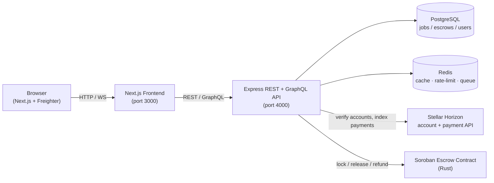
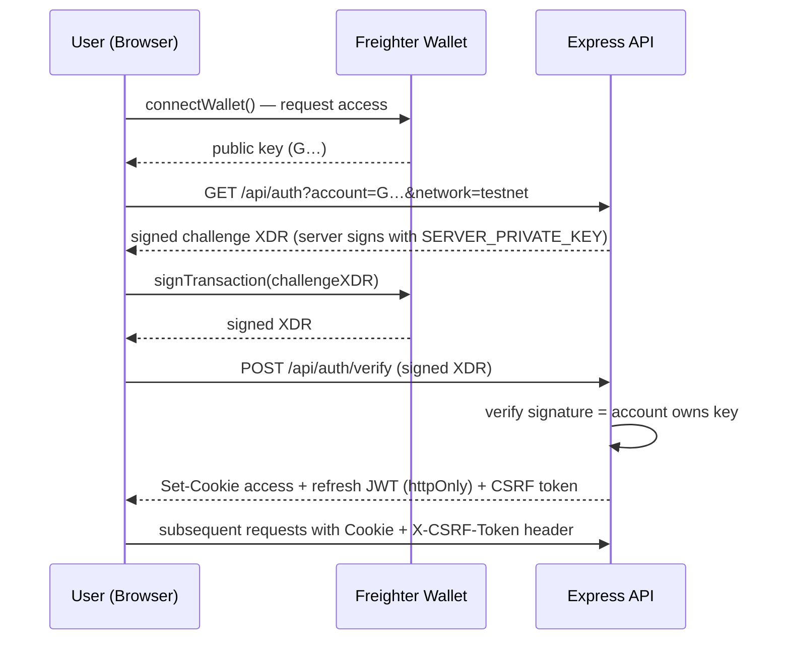
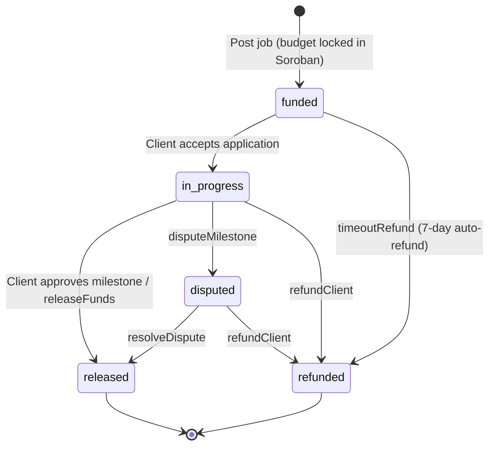

# Stellar MarketPay — Architecture

> High-level architecture reference for new contributors. This document explains
> how the major pieces fit together so you can start contributing without
> reverse-engineering the codebase.

## 1. System Overview

Stellar MarketPay is a decentralised freelance marketplace. Clients post jobs
with a budget locked in a **Soroban smart-contract escrow**; freelancers apply,
the client accepts, work is delivered, and funds are released on-chain when the
client approves. The web app talks to an Express API that orchestrates
PostgreSQL, Redis, Stellar Horizon, and a Soroban escrow contract.

### Component Diagram



ASCII fallback:

```
 Browser (Next.js + Freighter wallet)
        │  HTTP / WebSocket
        ▼
   Next.js Frontend  ──REST/GraphQL──►  Express API
                                          │
                       ┌──────────────────┼──────────────────────┐
                       ▼                  ▼                       ▼
                  PostgreSQL          Redis                Stellar Horizon
                  (jobs, escrows,     (cache, rate-limit,  (account checks,
                   users, messages)    email queue)          payment indexing)
                       │
                       ▼
                 Soroban Escrow Contract (Rust)
                 lock → release → refund
```

## 2. Repositories & Layers

| Layer        | Path            | Tech                                                         |
| ------------ | --------------- | ------------------------------------------------------------ |
| Frontend     | `frontend/`     | Next.js, React, Tailwind CSS, Freighter wallet SDK           |
| Backend API  | `backend/src/`  | Node.js + Express, REST routes + a GraphQL handler, PostgreSQL, Redis |
| Smart contract | `contracts/`  | Stellar **Soroban** smart contract written in Rust           |
| Shared       | `packages/`     | Shared backend packages and a TypeScript/JS client SDK       |
| Infra        | `infra/`, `deploy/`, `docker-compose*.yml` | Docker, Helm, Nginx, Cloudflare, Prometheus/Grafana |

The backend mounts many feature routers under `/api/*`
(`auth`, `jobs`, `applications`, `escrow`, `profiles`, `messages`,
`notifications`, `disputes`, `admin`, `developer`, …) and serves a GraphQL
endpoint via `backend/src/graphql`. A WebSocket server (`/ws/realtime`)
pushes real-time notifications to connected wallets.

## 3. Authentication Flow (SEP-10 Wallet Challenge)

Authentication is **passwordless** and uses the
[Stellar SEP-0010](https://stellar.org/protocol/sep-10) web-auth standard.
The wallet proves ownership of a Stellar account by signing a server-issued
challenge transaction; on success the API issues JWT access/refresh cookies.



Key points:

- **Challenge**: `backend/src/routes/auth.js` builds the challenge with
  `Utils.buildChallengeTx` signed by the server keypair (`SERVER_PRIVATE_KEY`).
- **Verify**: the signed XDR is submitted to `POST /api/auth/verify`; the API
  confirms the signature matches the claimed account and issues a token pair.
- **Token management**: `backend/src/services/authTokens.js` issues short-lived
  access tokens and rotating refresh tokens stored as `httpOnly` cookies, plus
  a double-submit `X-CSRF-Token` for state-changing requests.
- **Client side**: `frontend/lib/wallet.ts` (`performSEP0010Auth`) and
  `frontend/lib/api/auth.ts` drive the connect → challenge → sign → verify flow.

## 4. Escrow Lifecycle

An escrow is created when a client posts a job and locks the budget in the
Soroban contract. The escrow record lives in PostgreSQL (`escrows` table) and is
mirrored on-chain. States: `funded` → `in_progress` → `released` / `refunded`
(with `disputed` / `locked` as intermediate states).



Steps:

1. **Post job → fund** — `jobService` inserts a job and an `escrows` row with
   `status = 'funded'` (`backend/src/services/jobService.js:846`), recording the
   Soroban `contract_id` and budget. The actual funds are locked by the Soroban
   contract (`backend/src/services/sorobanClient.js`).
2. **Accept** — freelancer applies (`applicationService`); the client calls
   `acceptApplication` (`backend/src/services/applicationService.js:445`) which
   moves the escrow to `in_progress`.
3. **Work & deliver** — the freelancer may submit a deliverable hash
   (`submitDeliverableHash`) and/or milestones.
4. **Release** — the client releases funds via `releaseFunds`,
   `releaseMilestone`, or `partialRelease` (`backend/src/services/escrowService.js`).
   On approval the on-chain contract pays the freelancer.
5. **Refund** — `refundClient` returns funds to the client; if an escrow stays
   `funded` for longer than `ESCROW_TIMEOUT_DAYS` (7 days), `timeoutRefund` is
   triggered automatically by the timeout checker.
6. **Dispute** — `disputeMilestone` / `markDisputed` freezes the escrow;
   `disputeService.resolveDispute` settles it (released or refunded, with
   evidence optionally anchored on-chain via `sorobanEvidence`).

## 5. Background Services

Most background work runs **in-process** as scheduled tasks started when the API
boots (see `backend/src/server.js`). They are not separate processes except
where noted.

| Service | Location | Role |
| ------- | -------- | ---- |
| **Escrow timeout checker** | `escrowService.startEscrowTimeoutChecker` | Hourly (`setInterval`, 1h) scan for `funded` escrows older than 7 days and auto-`timeoutRefund` them. |
| **Indexer** | `indexerService` (`IndexerService`) | Polls Stellar Horizon for payments involving the platform wallet, classifying escrow releases and donations and storing them for audit/analytics. |
| **Price alert service** | `priceAlertService` | `setInterval` loop that checks the XLM price and fires user-configured price alerts. |
| **Saved-search alert service** | `savedSearchAlertService` | `setInterval` loop matching new jobs against users' saved searches and emitting notifications. |
| **WebSocket event cleanup** | `wsEventCleanupService.startWsEventCleanup` | `setInterval` cleanup of stale real-time event records. |
| **Daily job digest** | `jobDigestService.runDailyDigest` | Intended to run on a cron (≈06:00 UTC) to build and email a personalised digest of matching jobs. |
| **Weekly digest** | `weeklyDigestService` | Similar digest on a weekly cadence. |
| **Email worker** | `workers/emailWorker.js` | Bull-style worker (`emailQueue.process`) that sends queued emails respecting user notification preferences. |
| **Notification dispatcher** | `notificationService.processPendingNotifications` | Drains the notification queue, sending emails (via worker), webhooks, and push notifications. |
| **Real-time push** | WebSocket server (`/ws/realtime`) | Streams escrow/job/notifications events to connected wallets. |

> Note: `priceAlertService`, `savedSearchAlertService`, and `wsEventCleanupService`
> register their own `setInterval` loops; the digest services expose a `run*`
> function meant to be triggered by an external cron/scheduler (or in-container
> cron) rather than a tight interval.

## 6. External Integrations

- **Stellar Horizon** (`HORIZON_URL`): verifies freelancer accounts exist
  (`verifyFreelancerAccount`), reads ledger/payment data for the indexer, and
  resolves ledger timestamps.
- **Soroban RPC + Escrow Contract** (`CONTRACT_ID`, `NEXT_PUBLIC_SOROBAN_RPC_URL`):
  the on-chain source of truth for locked/released/refunded funds. The frontend
  can run in `NEXT_PUBLIC_USE_CONTRACT_MOCK=true` mode for offline development.
- **Redis**: caching (`cacheService`), API-key rate-limit counters, and the
  Bull email queue.
- **PostgreSQL**: system of record for jobs, escrows, profiles, applications,
  messages, disputes, notifications, and audit logs (sequential migrations
  `V1`–`V49` via `npm run migrate`).

## 7. Where to Start Reading

- API entry point: `backend/src/server.js`
- Auth: `backend/src/routes/auth.js`, `backend/src/services/authTokens.js`
- Jobs/escrow creation: `backend/src/services/jobService.js`, `backend/src/services/escrowService.js`
- Escrow routes: `backend/src/routes/escrow.js`
- Contract client: `backend/src/services/sorobanClient.js`
- Frontend wallet/SEP-10: `frontend/lib/wallet.ts`, `frontend/lib/api/auth.ts`
- Contract source: `contracts/`
